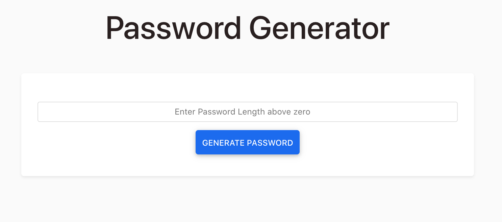

# Password Generator

## Available Scripts
In the project directory, you can run:

### `yarn install`

Install all the project packages

### `yarn start`

Runs the app in the development mode.\
Open [http://localhost:3000](http://localhost:3000) to view it in the browser.

### `yarn test`

Launches the test runner in the interactive watch mode.\

### `yarn build`

Builds the app for production to the `build` folder.\

